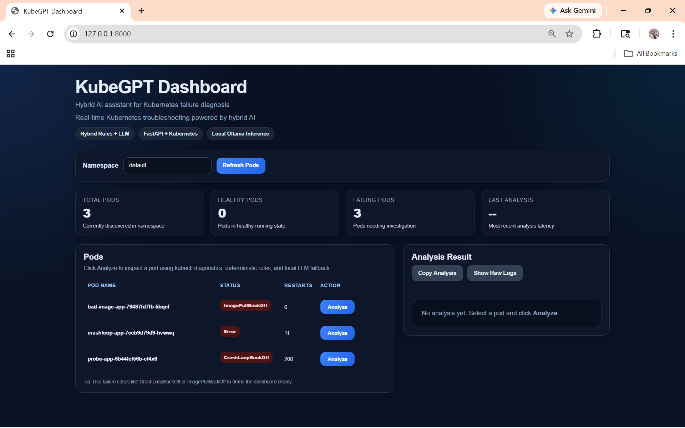
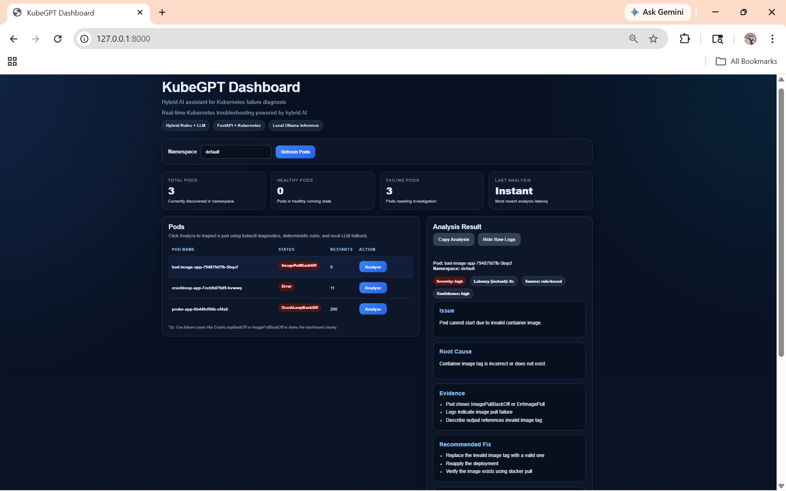
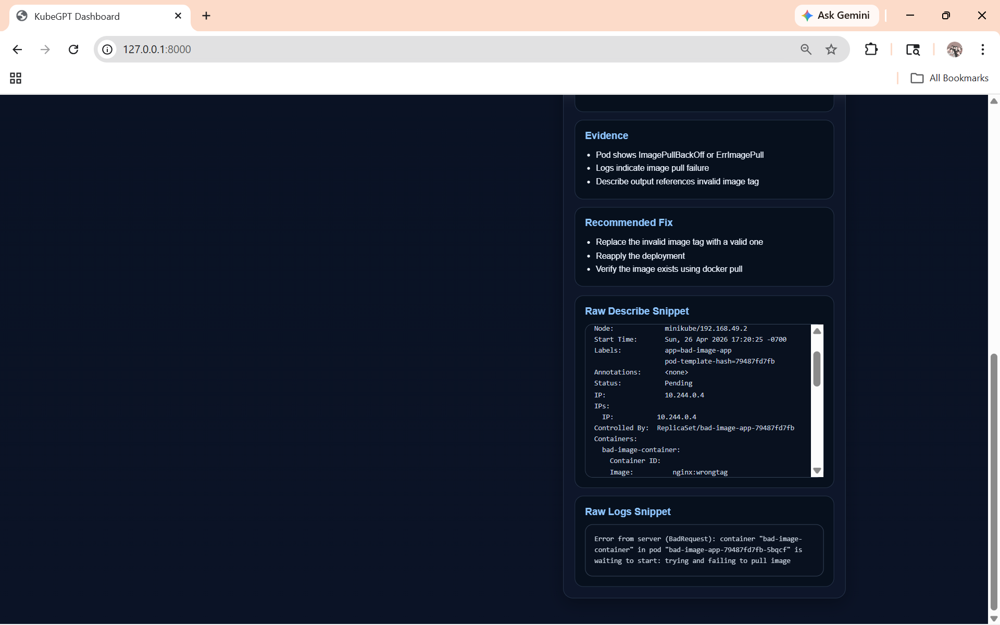
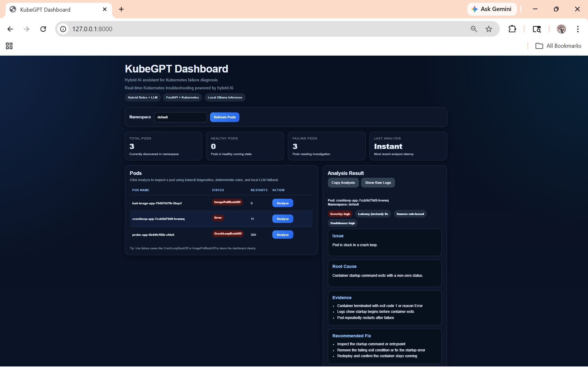

# KubeGPT Dashboard — AI-Powered Kubernetes Incident Triage & Root Cause Analysis

> Hybrid AI debugging assistant that reduces Kubernetes manual debugging time by ~40–60%  
> Built with FastAPI, Python, Kubernetes, Ollama, Docker

---

## The Problem

Debugging Kubernetes pod failures is painful. When a pod crashes, engineers typically:

1. Run `kubectl describe pod` — get walls of verbose output
2. Run `kubectl logs` and `kubectl logs --previous` — parse raw log noise
3. Cross-reference error messages with documentation
4. Repeat across multiple pods

This process is slow, repetitive, and requires deep Kubernetes knowledge. **KubeGPT automates it.**

---

## What It Does

KubeGPT Dashboard is a **local-first Kubernetes debugging assistant** that:

- Collects pod diagnostics automatically via `kubectl`
- Runs **deterministic rule-based analysis** for known failure patterns (fast, no AI cost)
- Falls back to a **locally-hosted LLM (Ollama)** for complex or ambiguous failures
- Returns structured incident reports with: **Issue → Root Cause → Evidence → Recommended Fix**

The hybrid approach reduced AI calls by ~70% compared to sending everything to an LLM, improving response latency while maintaining diagnostic quality.

---

## Key Metrics

| Metric | Result |
|---|---|
| Manual debugging time reduction | ~40–60% |
| AI call reduction (vs full-LLM approach) | ~70% |
| Supported failure types | 4 (ImagePullBackOff, CrashLoopBackOff, Probe failures, Command failures) |
| Deployment | One-command via Docker / local uvicorn |

---

## Supported Failure Scenarios

| Failure | Description |
|---|---|
| `ImagePullBackOff` / `ErrImagePull` | Wrong image name, missing tag, private registry auth failure |
| `CrashLoopBackOff` | Container crashes repeatedly — startup errors, bad commands |
| Liveness Probe Failure | Health check misconfigured or app not responding in time |
| Startup Command Failure | Entrypoint or CMD errors causing immediate exit |

---

## How It Works

```
User selects pod → clicks Analyze
↓
Backend collects:
kubectl describe pod
kubectl logs
kubectl logs --previous
↓
Rule-based analyzer runs first
→ Known pattern? → Return structured result immediately
→ Unknown pattern? → LLM fallback via Ollama
↓
Structured response returned to dashboard:
Issue | Root Cause | Evidence | Recommended Fix
```

---

## Tech Stack

| Layer | Technology |
|---|---|
| Backend API | FastAPI (Python) |
| Kubernetes Integration | kubectl, Kubernetes Python client |
| AI / LLM | Ollama (local LLM, no API key needed) |
| Rule Engine | Custom Python heuristics |
| Frontend | HTML / CSS / JavaScript |
| Containerization | Docker |
| Manifests | Kubernetes YAML (badimage, crashloop, probe) |

---

## Project Structure

```
kubegpt/
├── app/
│   ├── main.py          # FastAPI entrypoints
│   ├── collector.py     # kubectl data collection
│   ├── analyzer.py      # Hybrid analysis pipeline
│   ├── heuristics.py    # Rule-based failure patterns
│   └── index.html       # Dashboard UI
├── manifests/
│   ├── badimage.yaml    # Test pod: ImagePullBackOff
│   ├── crashloop.yaml   # Test pod: CrashLoopBackOff
│   └── probe.yaml       # Test pod: Liveness probe failure
├── screenshots/
└── README.md
```
---

## Running Locally

**Prerequisites:** Python 3.9+, kubectl configured, Ollama installed

```bash
# Clone the repo
git clone https://github.com/prerana-puttaswamy/kubegpt-dashboard.git
cd kubegpt-dashboard/app

# Install dependencies
pip install -r requirements.txt

# Start the server
uvicorn main:app --reload
```

Open in browser: `http://127.0.0.1:8000`

**To test with sample failing pods:**
```bash
kubectl apply -f manifests/badimage.yaml
kubectl apply -f manifests/crashloop.yaml
kubectl apply -f manifests/probe.yaml
```

---

## Screenshots

### Dashboard Overview


### ImagePullBackOff — Overview


### ImagePullBackOff — Detailed Analysis


### CrashLoopBackOff — Root Cause Analysis


---

## Why Local-First?

Most AI debugging tools send your Kubernetes logs to external APIs — which raises **security and privacy concerns** for production clusters. KubeGPT runs entirely locally:

- No logs leave your machine
- No API keys required
- Works in air-gapped environments
- LLM runs via Ollama on your hardware

---

## Future Improvements

- Namespace dropdown selector
- Multi-pod batch analysis
- Export analysis reports as PDF/JSON
- Incident history tracking and trend detection
- Support for more failure types (OOMKilled, Evicted, Pending scheduling failures)

---

## Author

**Prerana Puttaswamy**  
MS Computer Science, California State University, Long Beach  
[GitHub](https://github.com/prerana-puttaswamy) | [LinkedIn](https://www.linkedin.com/in/prerana-puttaswamy-a07836224/) | [Portfolio](https://preranap.vercel.app)
